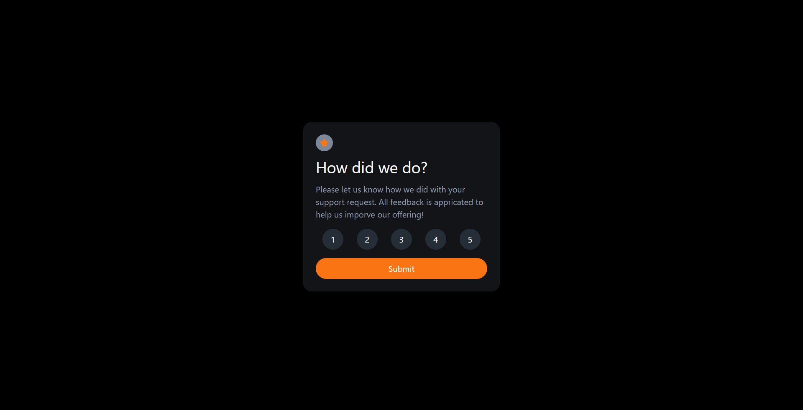

# Frontend Mentor - Interactive rating component solution

This is a solution to the [Interactive rating component challenge on Frontend Mentor](https://www.frontendmentor.io/challenges/interactive-rating-component-koxpeBUmI). Frontend Mentor challenges help you improve your coding skills by building realistic projects. 

## Table of contents

- [Overview](#overview)
  - [The challenge](#the-challenge)
  - [Screenshot](#screenshot)
  - [Links](#links)
- [My process](#my-process)
  - [Built with](#built-with)
  - [What I learned](#what-i-learned)
  - [Continued development](#continued-development)
  - [Useful resources](#useful-resources)
- [Author](#author)
- [Acknowledgments](#acknowledgments)

## Overview
Components built with React, Typescript, Tailwind css

### The challenge

Users should be able to:

- View the optimal layout for the app depending on their device's screen size
- See hover states for all interactive elements on the page
- Select and submit a number rating
- See the "Thank you" card state after submitting a rating

### Screenshot

### Links

- Solution URL: [Solution Url](https://www.frontendmentor.io/solutions/interactiveratingcomponent-with-reacttypescript-tailwind-UIlx3oSj3g)
- Live Site URL: [Live website with vercel](https://interactive-rating-component-zeta-azure.vercel.app/)

## My process

### Built with

- [React](https://reactjs.org/) - JS library
- [Typescript](https://www.typescriptlang.org/) - Typescript
- [Tailwind](https://tailwindcss.com/) - Tailwind CSS

### What I learned

I should use mobile first development

### Continued development

Error component can be added

### Useful resources

- [Tailwind Docs](https://tailwindcss.com/docs/installation) - How to use Tailwind.
- [Google](https://www.google.com) - When you get stuck this is the most essential thing.

## Author

- Website - [Utku Kaan Arasan](https://www.utkukaanarasan.com)
- Frontend Mentor - [@UtkuKaanArasan](https://www.frontendmentor.io/profile/UtkuKaanArasan)

## Acknowledgments

- www.google.com
- www.stackoverflow.com
